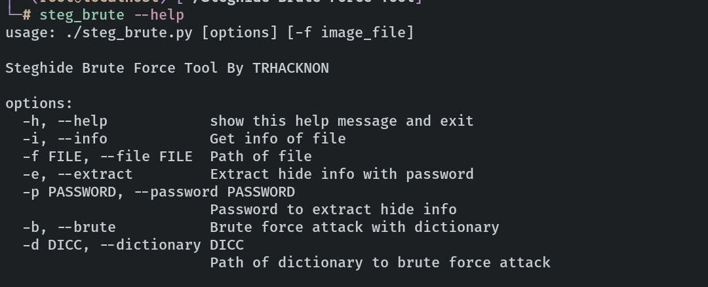

# Steghide Brute Force Tool
Execute a brute force attack with Steghide to file with hide information and password established.

# How it work
Cloning this repo to your computer and typing in your terminal: 
<code>git clone https://github.com/trhacknon/Steghide-Brute-Force-Tool.git</code>

## with binary

<code>wget https://github.com/trhacknon/Steghide-Brute-Force-Tool/releases/download/v-2.0/steg_brute && mv steg_brute /usr/local/bin/</code>

<code>steg_brute --help</code>

##

To launch the script by typing: 
<code>python steg.py [option] [-f file]</code>

For more instructions type 
<code>python steg.py -h</code>

# Version
Steg Brute Force Tool V1.0
mod by trhacknon for depreciated dependencies cause
